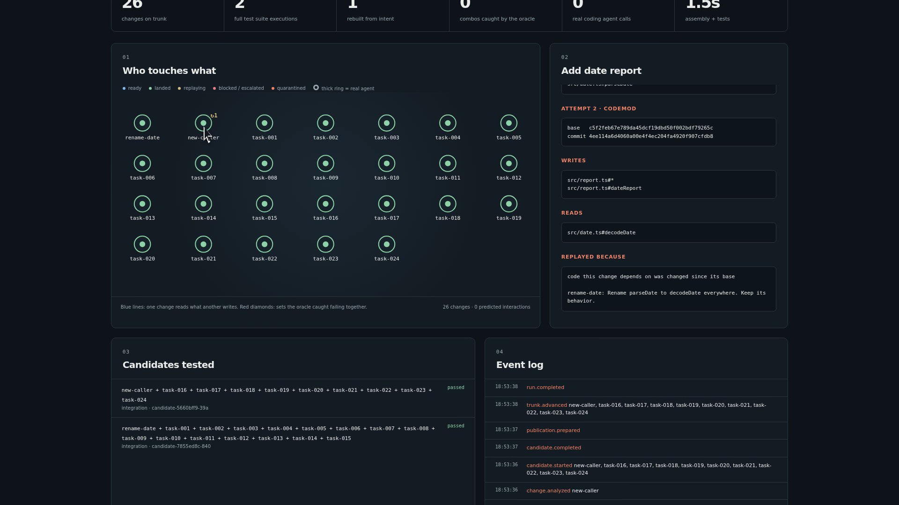
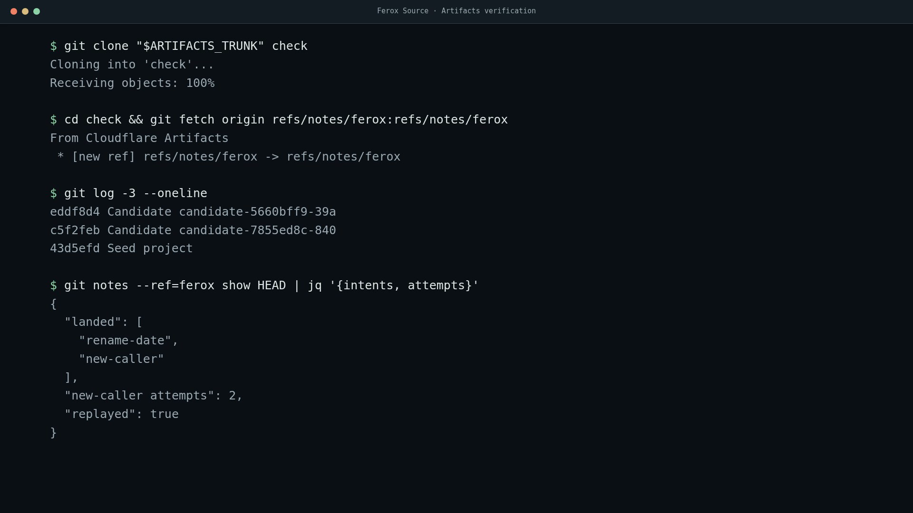

<div align="center">

# Ferox Source

**Keep the intent. Rebuild the change.**

Change integration for a lot of coding agents working on one repo at the same time.
Built on Cloudflare Workers and Artifacts.

[


](https://developers.cloudflare.com/workers/)
[


](https://developers.cloudflare.com/artifacts/)
[


](.nvmrc)
[


](package.json)

[


](test/core.test.mjs)
[


](evidence/cloud-smoke.json)
[


](package.json)
[


](LICENSE)

[Watch the 3:31 demo](video/ferox-demo.mp4) · [Terminal proof](video/ferox-terminal-proof.mp4) · [How it works](docs/how-it-works.md) · [Limits](docs/limits.md)



</div>

---

## The problem

Agent A renames `parseDate` to `decodeDate`.
Agent B adds a new file that calls `parseDate`.

Different files. Git merges them clean. The build is broken.

A merge queue catches it after the fact, then someone has to figure out which of the 26 changes in the batch did it and fix one by hand. With a handful of humans that's annoying. With dozens of agents pushing at once it's most of your day.

## What Ferox does instead

Every change carries its **intent**: the task and the acceptance checks. The diff is just a cache of that intent against one trunk commit.

1. Before running anything, Ferox reads each change's TypeScript and works out which symbols it writes, which it breaks, and which it reads.
2. A lands. B reads a symbol A broke, so B's diff is stale.
3. Ferox throws B's diff away and has an agent rebuild B from its task, against the new trunk, with A's intent in the prompt.
4. B lands calling `decodeDate`.

Flip the order and the rename is the one that gets rebuilt, and it renames B's new call too.

Nothing lands on trunk without passing strict `tsc`, the invariants, and every acceptance check that has ever landed. The footprint analysis only decides what to batch and what to replay. It never decides what lands.

<details>
<summary><b>The rest of the loop</b></summary>

<br>

- **Failing sets.** When a batch fails, Ferox narrows it down to the smallest set that fails together (ddmin style, with a budget). Unrelated work in the batch still lands.
- **Replay cap.** A change gets rebuilt at most twice. After that it escalates with its transcript instead of looping.
- **Protected policy.** A change that touches the checks themselves gets quarantined before it's validated.
- **Compare-and-set publish.** Trunk only moves if it's still where the candidate was built. A prepared publication survives a crash between the ref update and the bookkeeping.
- **Receipts.** Every candidate is kept with its parent, tree, policy hash and the oracle's real output. You can rerun any of them exactly.

Full write-up in [docs/how-it-works.md](docs/how-it-works.md).

</details>

## Where Cloudflare comes in

| Piece | What it does here |
|---|---|
| **Artifacts** | Trunk is an Artifacts repo. Every agent attempt gets its own fork. |
| **Repo-scoped tokens** | A fork token can push to its fork and nothing else. The smoke test checks that it gets a 403 on trunk. |
| **Workers** | The bridge Worker creates repos, forks, and mints tokens. The runner never holds account credentials. |
| **Durable Objects** | A SQLite-backed Registry keeps fork and token bookkeeping idempotent across retries. |
| **Git notes** | Intents and attempt lineage ride along in `refs/notes/ferox`, so they travel with any clone. |

## Numbers

Real runs on Cloudflare Artifacts. 24 agents plus the workload's own changes, 3 reps each, median shown. `baseline` is a fair merge queue: it validates before publishing and repairs semantic failures too, so it's not a strawman.

| Workload | Mode | Landed | Oracle runs | Integrate time |
|---|---|---:|---:|---:|
| `semantic` (rename vs. caller) | **ferox** | 26/26 | **2** | **8.6s** |
|  | baseline | 26/26 | 12 | 17.2s |
| `semantic-reversed` | **ferox** | 26/26 | **2** | **9.3s** |
|  | baseline | 26/26 | 12 | 17.1s |
| `independent` | ferox | 24/24 | 2 | 4.4s |
|  | baseline | 24/24 | 2 | 4.2s |
| `pair` (only fail together) | ferox | 25/26 | 13 | 19.5s |
|  | baseline | 25/26 | 13 | 19.7s |

Where Ferox helps is the semantic case: it sees the conflict before running anything, so it skips the failed batch and the hunt for who broke it. On independent work and behavioral failures that only show up at runtime, it's a tie. I'm not going to pretend otherwise.

Raw data in [`benchmarks/results.json`](benchmarks/results.json), cloud smoke run in [`evidence/cloud-smoke.json`](evidence/cloud-smoke.json).

## Run it locally

Two minutes. Needs Node 22.18+ and Git, on Linux or macOS.

```bash
git clone https://github.com/itsbryanman/FeroxSource && cd FeroxSource
npm ci
npm test             # 20 tests
npm start            # http://127.0.0.1:8788
```

Pick a workload, hit **Draft changes**, then **Integrate**. Click any node for its intent, footprint and replay history. Click any candidate for the real oracle output. Switch the integrator to **Merge queue**, run it again, and compare in the runs table.

From the terminal:

```bash
npm run demo -- semantic 24             # rename vs. caller, plus 24 more agents
npm run demo -- semantic-reversed 24    # same thing, caller lands first
npm run demo -- pair 24                 # two changes that only fail together
npm run demo -- semantic 24 baseline    # merge queue, for comparison
npm run benchmark -- 24 3               # every workload, both modes, 3 reps
```

Or in Docker:

```bash
FEROX_API_TOKEN=$(openssl rand -hex 16) docker compose up --build
```

## Run it on Cloudflare

Needs a Workers Paid account with Artifacts.

```bash
npm run cloud:setup     # logs in, deploys the Worker, sets the secret, writes .env.cloud
npm run cloud:smoke     # 6 checks against real Artifacts
npm run start:cloud     # same dashboard, Artifacts backend
```

The smoke test creates a trunk, runs rename vs. caller, gives every attempt its own fork, checks a fresh clone of trunk matches the local ledger, checks the notes made the trip, and makes sure a fork token gets rejected on trunk. Clean up rehearsal repos with `npm run cloud:cleanup -- <run dir>`.

## With a CLI coding agent

```bash
FEROX_AGENT=command FEROX_AGENT_CMD=./my-agent npm run demo -- llm 8
```

The `llm` workload has a task no codemod can do. Your configured agent writes it, the rename lands underneath it, and Ferox asks the agent to rebuild it against the new parser.

Other agents' intents go into the prompt fenced off as data, not instructions. Transcripts land in the run's `evidence/agents/` folder.

<details>
<summary><b>Agent settings</b></summary>

<br>

| Variable | Default | |
|---|---|---|
| `FEROX_AGENT` | codemod | `command` for an external CLI agent |
| `FEROX_AGENT_CMD` | | binary for `command` |
| `FEROX_AGENT_ARGS` | | args for `command`, as a JSON array. Prompt goes on stdin |
| `FEROX_AGENT_MODEL` | | optional model passed to the agent command |
| `FEROX_AGENT_MAX_USD` | `0.50` | per-call budget |
| `FEROX_AGENT_TIMEOUT_MS` | | per-call timeout |
| `FEROX_AGENT_PARALLEL` | | concurrent agent calls |

</details>

## Check it with plain Git

You don't have to trust the dashboard. Every demo prints its run directory.



```bash
git clone RUN_DIR/trunk.git check && cd check
git fetch origin refs/notes/ferox:refs/notes/ferox
git log --notes=ferox        # every landing carries its intents and attempt lineage
```

Failed candidates are kept. Rerun one exactly:

```bash
FEROX_DATA=RUN_DIR npm run reproduce -- CANDIDATE_ID    # exits 1 on purpose if it failed
```

## Layout

```
src/engine.mjs              integration loop: stale check, batch, oracle, land, reduce, replay
src/analyzer.mjs            TypeScript write / break / read footprints
src/agents.mjs              codemod agent and the CLI agent adapter
src/oracle.mjs              trusted checks, kept outside the agent's repo
src/git.mjs                 workspaces, assembly, compare-and-set publish, notes
src/cloudflare-bridge.mjs   runner side of the Artifacts bridge
cloudflare/worker.ts        bridge Worker, Registry Durable Object, dashboard assets
web/                        dashboard, no framework
scripts/                    demo, benchmark, cloud setup / smoke / cleanup, recording
test/                       both rename orders, agent replay, token boundary, crash recovery
```

## Limits

Read [docs/limits.md](docs/limits.md) before you believe any of this. Short version:

- One trunk, one integrator.
- Footprints are syntax level and name based. No type checker. They're hints, and the oracle is the only thing that decides what lands.
- TypeScript only. Other files count as touching everything.
- Most agents in the scale runs are codemods so runs are fast and repeatable. The real-agent path is the `llm` workload.

## License

MIT. See [LICENSE](LICENSE).

<div align="center">
<sub>Built by <a href="https://github.com/itsbryanman">Bryan Cruse</a> · Backwoods Development</sub>
</div>
